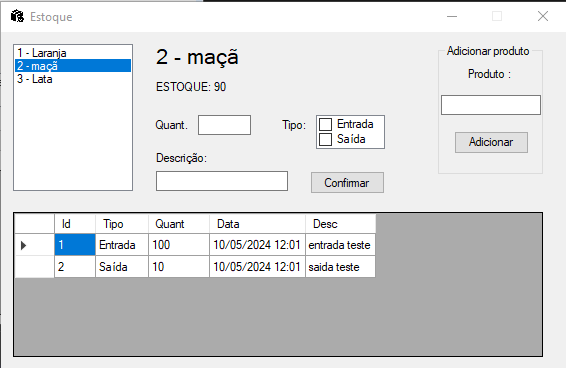

# Estoque App

Desenvolvido em C# através do Visual Studio e utilizando WinForms .NET Framework, este aplicativo é um gerenciador de estoque simples e eficaz. Para emular a funcionalidade de um banco de dados, criei dois modelos essenciais: Produto e Movimentações. Além disso, para simular o armazenamento dos dados, elaborei um repositório que opera em memória, empregando listas para gerenciar tanto os produtos quanto suas movimentações.

## Detalhes do Sistema

### Adicionar um Produto

Nesta tela, é possível cadastrar um novo produto inserindo seu nome e clicando no botão "Adicionar Produto".

### Lista de Produtos

Aqui, à esquerda, é apresentada uma lista dos produtos cadastrados, exibindo seus IDs.

### Produto Selecionado e Seu Estoque

No centro da tela, são exibidos o ID e o nome do produto selecionado, juntamente com seu estoque atual.

### Operações de Entrada e Saída de Produtos

Nesta área central, é possível realizar operações de entrada e saída de produtos. O campo "Quant." permite inserir a quantidade da operação, enquanto o campo "Tipo" determina se é uma entrada ou saída. Há também um espaço para adicionar uma descrição da operação e um botão para confirmar a operação.

### Histórico de Operações

Nesta tabela, são listadas as operações do produto selecionado, mostrando o ID da operação, o tipo (entrada/saída), a quantidade, a data e uma descrição da operação.
